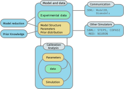

# Subcellular model building and calibration

We develop tools for data-driven building of subcellular biochemical signaling pathway models. This includes interoperable modules for: model building, calibration (parameter estimation) and model analysis. All information needed to perform these tasks are stored in a structured, human- and machine-readable file format based on SBtab (Lubitz et al. 2016). The information contained in the SBtab files includes: models, experimental calibration data and prior assumptions on parameter distributions. The toolset enables simulations of the same model in simulators with different characteristics, e.g. STEPS, NEURON, MATLAB’s Simbiology and R via automatic code generation. The parameter estimation is done by optimization or Bayesian approaches. Model analysis includes global sensitivity analysis and functionality for analyzing thermodynamic constraints and conserved moieties.

The documentation for the SBtab format are here: https://github.com/tlubitz/SBtab

The documentation of each respective module (tool) from our group can be found in the READ ME file of that repository, i.e.:
- Uncertainty Quantification and Global Sensistivity Analyses (UQSA) https://github.com/icpm-kth/uqsa
- etc

[1] Lubitz, T., Hahn, J., Bergmann, F.T., Noor, E.,. Klipp, E, Liebermeister, W. (2016). SBtab: A flexible table format for data exchange in systems biology. Bioinformatics, 15;32(16), 2559-61

